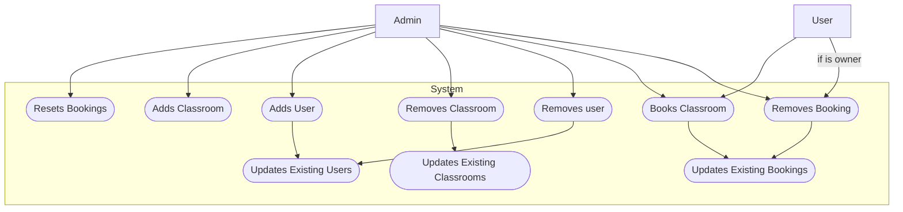
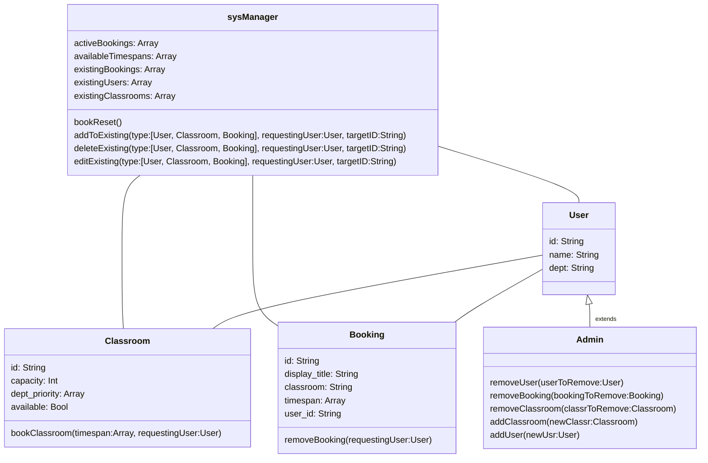

# UML Diagrams
## Use-case Diagram

```
flowchart TD
    actor1["User"]
    actor2["Admin"]

    subgraph System
        uc1([Adds User])
        uc3([Removes user])
        uc2([Adds Classroom])
        uc8([Removes Classroom])
        uc4([Removes Booking])
        uc5([Books Classroom])
        uc6([Resets Bookings])
        uc10([Updates Existing Users])
        uc11([Updates Existing Bookings])
        uc12([Updates Existing Classrooms])

end

actor2 --> uc6
actor2 --> uc2
actor2 --> uc1
actor2 --> uc8
actor2 --> uc3
actor2 --> uc5
actor2 --> uc4

actor1 --> uc5
actor1 --if is owner--> uc4

uc1 --> uc10
uc3 --> uc10

uc8 --> uc12
uc5 --> uc11
uc4 --> uc11


```



## Class Diagram

```
classDiagram

class Classroom {
    id: String
    capacity: Int
    dept_priority: Array
    available: Bool
    bookClassroom(timespan:Array, requestingUser:User) 
}

class Admin {
    removeUser(userToRemove:User) 
    removeBooking(bookingToRemove:Booking) 
    removeClassroom(classrToRemove:Classroom) 
    addClassroom(newClassr:Classroom) 
    addUser(newUsr:User)
}

class User {
    id: String
    name: String
    dept: String
}

class Booking {
    id: String
    display_title: String
    classroom: String
    timespan: Array
    user_id: String
    removeBooking(requestingUser:User)
}

class sysManager {
    activeBookings: Array
    availableTimespans: Array
    existingBookings: Array
    existingUsers: Array
    existingClassrooms: Array
    bookReset()
    addToExisting(type:[User, Classroom, Booking], requestingUser:User, targetID:String)
    deleteExisting(type:[User, Classroom, Booking], requestingUser:User, targetID:String)
    editExisting(type:[User, Classroom, Booking], requestingUser:User, targetID:String)
}


sysManager -- Classroom
sysManager -- Booking
sysManager -- User
User <|--"extends" Admin
User -- Classroom
User -- Booking
```


